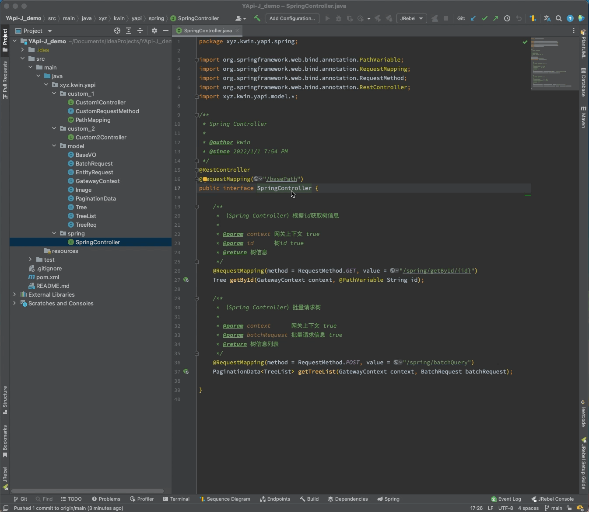
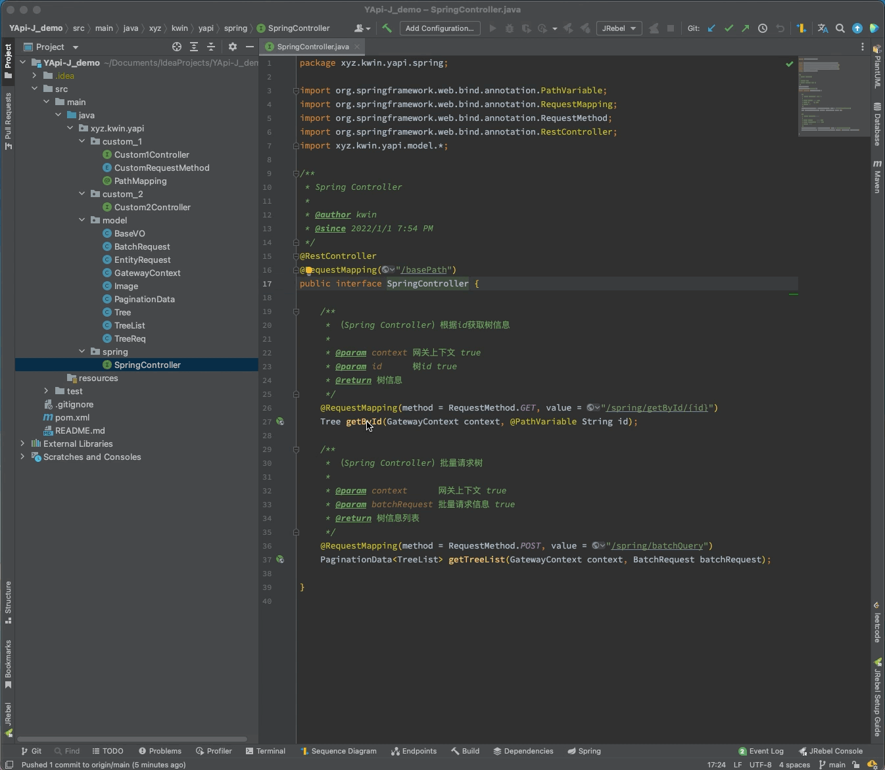
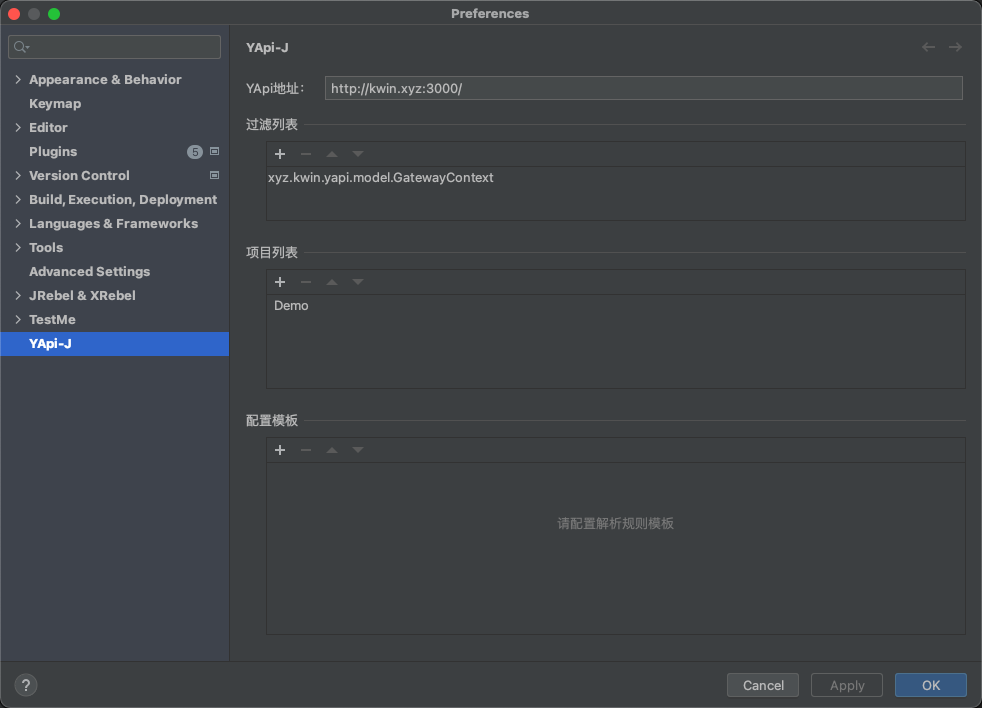
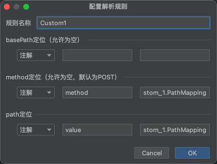
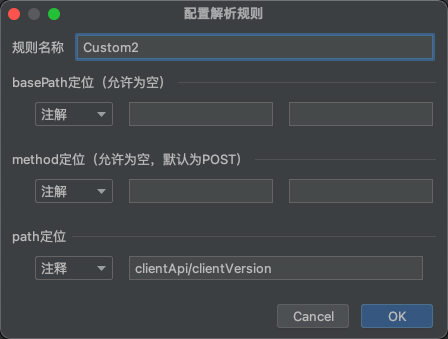

# YApi J

## 简介

通过模板配置，根据规范的JavaDoc/注解解析接口文档，一键上传至YApi，支持自定义注册方式（公司内部网关等）。
使用前请先进行YApi相关配置，及解析规则配置。

上传效果Demo可前往 [kwin-YApi](http://kwin.xyz:3000/) 查看，访客账号为visitor@foxmail.com/visitor。

### 使用

#### 上传接口类

在类名上使用快捷键Ctrl+Alt+U（Command+Option+U）或右键选择Upload to YApi进行上传，将对选中类中的public且非static/final方法进行解析上传（同时需要满足选中解析规则的注释或注解）。

#### 上传接口

在方法上使用快捷键Ctrl+Alt+U（Command+Option+U）或右键选择Upload to YApi进行上传，如果满足条件则进行解析上传。

### 配置

* YApi地址：必填。
* 过滤列表：允许为空。添加类的全限定名以过滤，在解析接口文档时不对列表中的类进行解析，通常用于内部网关上下文等对象的过滤。
* 项目列表：必填，在配置前请先配置YApi列表并保存。添加YApi项目的token，将自动将其解析为项目名称（进入配置页时将进行刷新，请及时删除无效token）。
* 配置模板：必填。配置接口文档的解析规则。

#### 模板的具体配置方式

*将鼠标悬浮在输入框上以展示输入提示*

* 规则名称：该字段全局唯一，以区分不同的接口文档解析规则。

* basePath定位：该配置允许为空。用于定位接口的基本路径，将解析接口类上的注释/注解。

* method定位：该配置允许为空。用于定位接口的请求方式，允许为空以支持内部统一网关接口注册方式，将默认以POST方式注册到YApi。

* path定位：必填。用于定位接口路径。当定位方式为注解时，依次填入注解中接口路径定位对应属性，例如value，及注解类全限定名；当定位方式为注释时，请填入注释对应tag。

#### 模板配置examples

##### Spring

##### 自定义注解

##### 自定义注释

**TIP:** path定位中，tag使用"/"分隔，解析时将以"_"拼接多个tag，例如「api_version」。

### 更多

更多问题请提issue或联系作者（kwin1113@foxmail.com）。